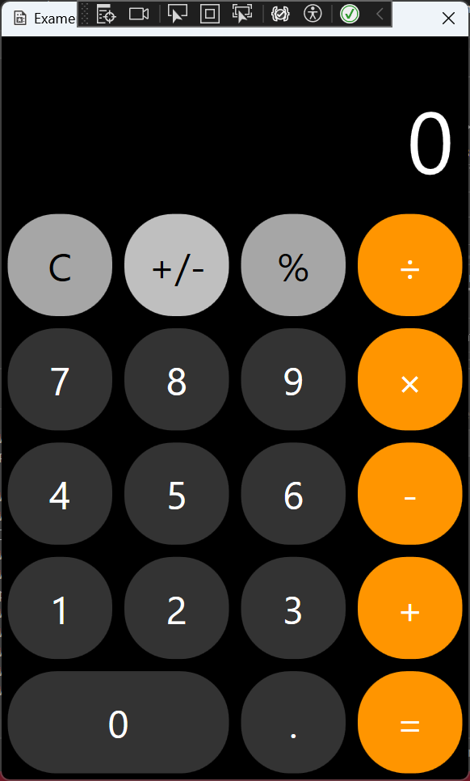

# iPhone Style Calculator for WPF

This project is a Windows Presentation Foundation (WPF) application that replicates the look and functionality of the iPhone calculator. The design focuses on simplicity, accuracy, and responsiveness, with a visually appealing interface inspired by Apple's iOS calculator.

## Features
- **iPhone-Like UI:** Recreates the sleek, rounded button design of the iPhone calculator using XAML.
- **Basic Operations:** Supports essential mathematical functions such as addition, subtraction, multiplication, and division.
- **Responsive Layout:** Adjusts smoothly to different window sizes and resolutions.
- **Memory Functions:** Includes common features like clearing, percent calculation, and toggling positive/negative values.
- **Keyboard Support:** Provides keyboard shortcuts for faster input.

## Technologies Used
- **WPF (XAML and C#):** The user interface is built using XAML, while C# handles the logic and event-driven programming.
- **MVVM Pattern:** Implements the Model-View-ViewModel pattern for better separation of concerns and maintainability.

## Getting Started
Clone the repository and open the solution in Visual Studio. Build and run the project to launch the calculator.

```bash
git clone https://github.com/jahswant/WPFiPhoneCalculator.git
```

## Screenshots


